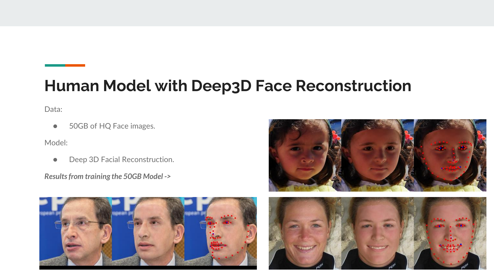

# 🪄 Promotional Generative AI [Experimental, Research-Based] 

<table align=center>
  <tr>
    <th style="text-align:center;">Input Image</th>
    <th style="text-align:center;">IC-Light Workflow Output</th>
    <th style="text-align:center;">SV3D AnimateDiff Output</th>
  </tr>
  <tr>
    <td style="text-align:center;"></td>
    <td style="text-align:center;"></td>
    <td style="text-align:center;"></td>
  </tr>
</table>

<table align=center>
  <tr>
    <th style="text-align:center;">Input</th>
    <th style="text-align:center;">Output</th>
  </tr>
  <tr>
    <td style="text-align:center;"></td>
    <td style="text-align:center;"></td>
  </tr>
</table>

## 📖 Introduction

This project aims to explore the opportunities and current limitations of Gen AI for promotional and advertisement photography, as a side-project for Advanced AI at Fontys UAS Eindhoven. The purpose is pure research and exploring the potential of these technologies at their current and future state.

#### The approach included:

1. Training a PyTorch model for research purposes of human face photography to generate Deep 3D Face Reconstruction based on [this repository](https://github.com/sicxu/Deep3DFaceRecon_pytorch).

2. Training Stable Diffusion LoRA models on promotional/advertisement photography datasets:
[Advertisement Photography SDXL LoRA](https://huggingface.co/martintmv/advertisement-photography-SDXL-LoRA)
[Advertisement Photography SD1.5 LoRA](https://huggingface.co/martintmv/advertisement-photography-SD1.5-LoRA)

3. Utilizing [ComfyUI](https://github.com/comfyanonymous/ComfyUI) to create workflows that make use of trained models, combining open source models and nodes to create a generative AI pipeline, later deployed on [Fal AI](http://fal.ai) for easy API endpoint usage.

## June 2024 - Presentation at Strijp TQ, Eindhoven:

## 🌐 Ethical Considerations

Data Privacy: Ensure all images used comply with intellectual property laws.
AI Ethics: Maintain transparency in AI processes to avoid biases.

## 📈 Impact

Users and businesses can significantly cut down the time and resources spent on product photography, while still achieving high-quality visuals for e-commerce and advertising.

## 📚 References

- [https://github.com/sicxu/Deep3DFaceRecon_pytorch](https://github.com/sicxu/Deep3DFaceRecon_pytorch)
- [https://github.com/ipazc/mtcnn](https://github.com/ipazc/mtcnn)
- [https://github.com/martintmv-git/comfy-anything](https://github.com/martintmv-git/comfy-anything)
- [https://github.com/comfyanonymous/ComfyUI](https://github.com/comfyanonymous/ComfyUI)
